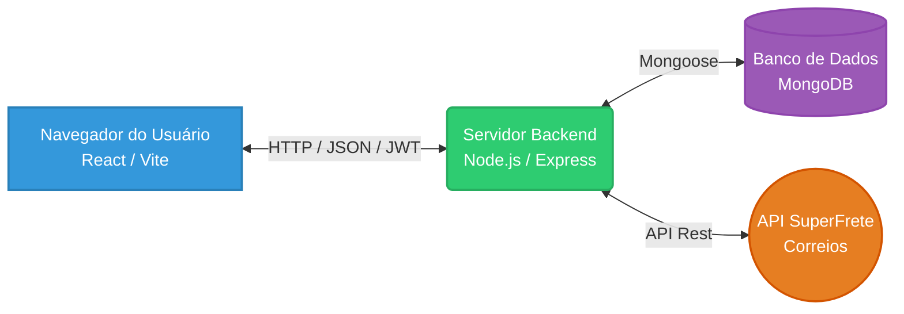
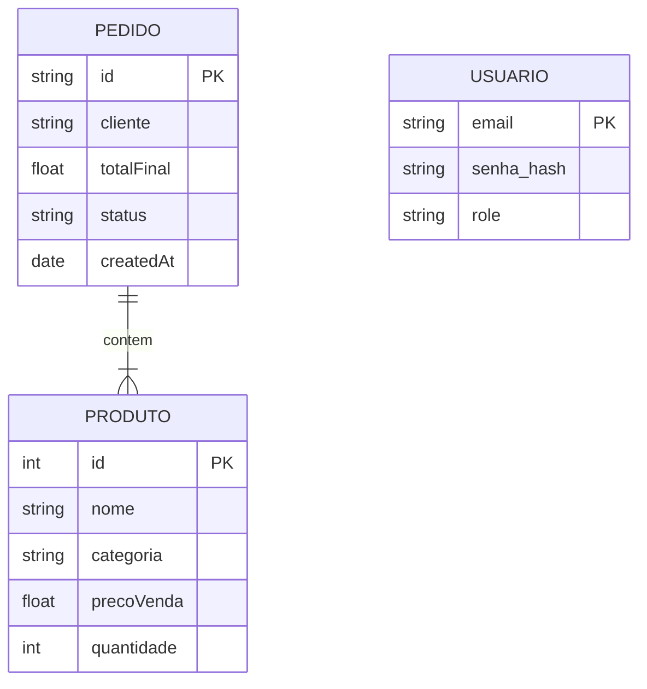
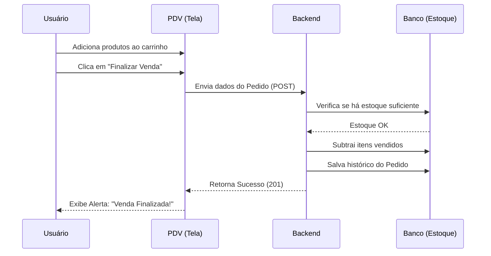

# 🦋 Manual do Usuário - Borbolêlalá

Bem-vindo ao Manual Oficial do Sistema de Gestão **Borbolêlalá Moda Infantil**. Este documento foi elaborado para guiar usuários na operação diária do sistema.

---

## 🏗️ 1. Arquitetura e Modelagem do Sistema

O sistema foi construído sob uma arquitetura moderna e desacoplada, separando a interface do usuário (Frontend) da lógica de negócios e banco de dados (Backend).

### 1.1 Diagrama de Arquitetura (Client-Server)


### 1.2 Diagrama de Entidade e Relacionamento (Modelo de Dados)


## 🚀 2. Primeiros Passos e Acesso ao Sistema

### 2.1 Como fazer Login

Para garantir a segurança dos dados da loja, o acesso é restrito.

1. Acesse a URL do sistema no seu navegador no seu computador, tablet ou smartphone.
2. Insira seu E-mail e Senha fornecidos pelo administrador.
3. Clique em Entrar.


Se os dados estiverem corretos, você será redirecionado para o Painel Principal (PDV).

## 🛒 3. Funcionalidades Principais e Fluxos de Trabalho

### 3.1 Frente de Caixa (PDV)
Esta é a tela onde as vendas acontecem. Ela é dividida em **Catálogo** (esquerda) e **Carrinho + Cálculo de Frete** (direita).


#### Fluxo de uma Venda Passo a Passo:

1. **Adicionar Itens**: Navegue pelas categorias e clique no botão `+ Adicionar` no produto desejado. Ele aparecerá no carrinho. Cada clique adiciona uma unidade do item. Caso o estoque seja insuficiente, uma mensagem de estoque esgotado será exibida.

2. **Cálculo de Frete (Opcional)**: Preencha os dados de dimensões da caixa e o CEP do cliente. Ao clicar em "Buscar" aparecerão as opções de frete, escolha uma das opções (ex: PAC, Sedex). O valor será somado ao total.

3. **Identificar Cliente (Opcional)**: Digite o nome do comprador (ou deixe em branco para "Consumidor Final").

4. **Finalizar Venda**: Confira o total e clique em "✅ Finalizar Venda". O sistema dará baixa no estoque automaticamente.

#### Diagrama de Sequência da Venda


### 3.2 Gestão de Estoque (Backoffice)
Local onde os produtos da loja são administrados.

- **Buscar Produto**: Use a barra de pesquisa `Procurar produto pelo nome...`.

- **Novo Produto**: Clique no botão roxo `+ Novo Produto`, preencha os dados e clique em `Salvar`.

- **Editar (✏️)**: Atualiza o preço ou quantidade de um item existente.

- **Excluir (🗑️)**: Remove o produto da loja (exige confirmação de segurança).


### 3.3 Relatórios e Gestão de Pedidos
Painel gerencial para acompanhar a saúde financeira da loja.

- **Dashboard**: Exibe o `Valor em Estoque`, o `Faturamento Líquido` e o total de `Vendas válidas` dos últimos 7 dias. A quantidade de dias pode ser ajustada com os botões de menos e mais.

- **Acompanhamento de Status**: Na tabela de vendas, altere o status de um pedido (ex: de Pendente para Enviado).

- **Ver Itens**: Clica no botão para expandir e ver exatamente o que o cliente comprou.

!

## 💡 4. Exemplos Práticos (Para usuários não técnicos)
### Cenário de Exemplo: Cliente quer comprar pelo WhatsApp e pediu envio pelos Correios.

**1.** Vá até a tela do `PDV` (Ponto de Venda).

**2.** Adicione a `Bermuda Jeans` que o cliente escolheu ao carrinho.

**3.** No lado direito, informe o Peso (ex: 0.5kg) e digite o CEP do cliente no campo.

**4.** Clique em Buscar (na seção de frete) e selecione a opção `Sedex`.

**5.** O sistema atualizará o `Total Geral` somando a roupa + frete.

**6.** Informe o valor ao cliente. Quando ele pagar via PIX, preencha o nome dele no sistema e clique em Finalizar Venda. O estoque estará atualizado.

**7.** Na seção de Acompanhamento de Status, localize o pedido e altere o status para `Pago`. O valor da venda entrará no `Faturamento Líquido` e contará como uma `Venda válida`.

## 🛠️ 5. Guia de Solução de Problemas (Troubleshooting)

| Problema / Mensagem de Erro | Causa Provável | Como Resolver |
|-----------------------------|----------------|---------------|
| "Sessão expirada. Faça login novamente." | O tempo de segurança do seu acesso (Token) acabou. | Clique OK e insira seu e-mail e senha novamente na tela de login. |
| "Estoque máximo atingido para este produto!" | Você tentou adicionar no carrinho mais itens do que a loja possui fisicamente. | Verifique a quantidade disponível no catálogo. Se houver erro, atualize o estoque na aba "Gestão de Estoque". |
| "Erro ao calcular frete. Verifique o CEP." | O CEP digitado está incompleto, incorreto ou a internet oscilou. | Verifique se o CEP possui 8 números e tente clicar em "Buscar" novamente. |
| A tela travou em "A carregar produtos..." | O servidor pode estar reiniciando ou sem conexão com a internet. | Atualize a página (F5). Se persistir, verifique a sua conexão com a internet ou contate o suporte. |
| Não consigo excluir um pedido/produto. | O seu usuário não tem permissão de Administrador (admin). | Apenas o gerente da loja pode fazer exclusões definitivas. Solicite a um administrador. |

## 🔧 6. Guia de Instalação e Configuração

Esta parte do manual destina-se ao administrador da loja responsável pela configuração inicial do sistema.

### 6.1 Requisitos de Sistema

Para instalar e executar o Borbolêlalá em um servidor local ou dedicado, certifique-se de que a máquina atenda aos seguintes requisitos mínimos:

- **Sistema Operacional**: Linux (Ubuntu/Debian recomendado) ou Windows.
- **Node.js**: Versão 18.x ou superior.
- **Banco de Dados**: MongoDB instalado e rodando (local ou Atlas).
- **Memória RAM**: Mínimo 2GB (4GB recomendado para produção).

### 6.2 Processo de Instalação Local (Modo Desenvolvimento)

Siga os passos abaixo para configurar o ambiente de desenvolvimento.

#### Passo 1: Configurar o Backend

1. Clone o repositório ou navegue até a pasta do servidor:
   ```bash
   cd borbolelala-backend
   ```

2. Instale as dependências necessárias:
   ```bash
   npm install
   ```

3. Configure as variáveis de ambiente:
   - Copie o arquivo `.env.example` para `.env`.
   - Edite o arquivo `.env` com suas credenciais do MongoDB e a chave secreta (`SECRET_KEY`).
   Exemplo:
   ```env
   MONGO_URI=mongodb://localhost:27017/borbolelala
   PORT=3001
   SECRET_KEY=sua_senha_super_secreta_aqui
   FRONTEND_URL=http://localhost:3000
   ```

4. Execute o servidor:
   ```bash
   npm run dev
   ```

#### Passo 2: Configurar o Frontend

1. Abra um novo terminal e navegue até a pasta do cliente:
   ```bash
   cd borbolelala-frontend
   ```

2. Instale as dependências:
   ```bash
   npm install
   ```

3. Configure as variáveis de ambiente:
   - Crie o arquivo `.env` na raiz do projeto.
   - Configure a URL do backend (do passo 1):
   Exemplo:
   ```env
   VITE_API_URL=http://localhost:3001
   ```

4. Inicie o servidor de desenvolvimento:
   ```bash
   npm run dev
   ```

#### Passo 3: Acesso

- O painel administrativo estará disponível em: `http://localhost:5173`
- O login inicial é feito com as contas cadastradas no banco de dados (veja a seção 6.3).

### 6.3 Contas de Teste (Credenciais)

Para testes, utilize uma das contas abaixo. O sistema cria automaticamente um usuário "Gerente" (Admin) no primeiro acesso. Se preferir, pode criar contas com privilégios específicos (colaborador).

**Conta Admin (Gerente):**
- **E-mail**: `[EMAIL_ADDRESS]`
- **Senha**: `123456` ou `admin` (dependendo da configuração inicial)

**Conta Colaborador (Staff):**
- **E-mail**: `[EMAIL_ADDRESS]`
- **Senha**: `123456`

*Nota: A senha padrão pode ser alterada após o login nas configurações do usuário.*

### 6.4 Dicas de Produção

- **Backend**: Configure o servidor para rodar com `npm run start` (modo produção). Use um gerenciador de processos como o PM2 para garantir que ele rode em segundo plano e reinicie em caso de falha.
- **Frontend**: Para produção, faça o build do projeto (`npm run build`) e sirva os arquivos estáticos usando um servidor web como o Nginx ou Apache.
- **Segurança**: Nunca use a chave secreta (`SECRET_KEY`) padrão em produção. Gere uma chave forte e aleatória.
- **Integração Correios**: Configure a variável de ambiente `SUPER_FRETE_TOKEN` com o token fornecido pelo SuperFrete para ativar o cálculo de fretes reais.