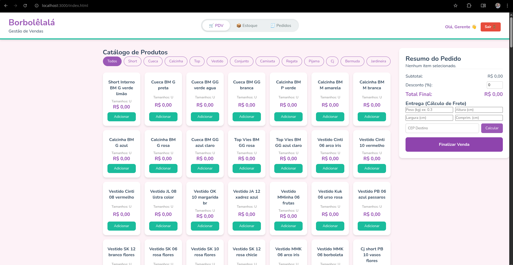
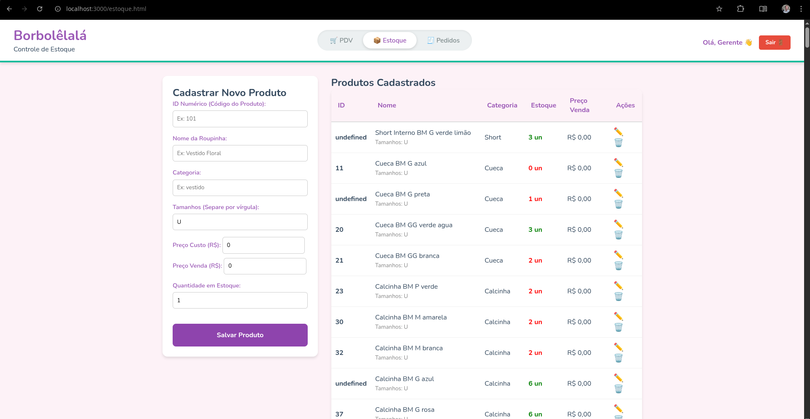
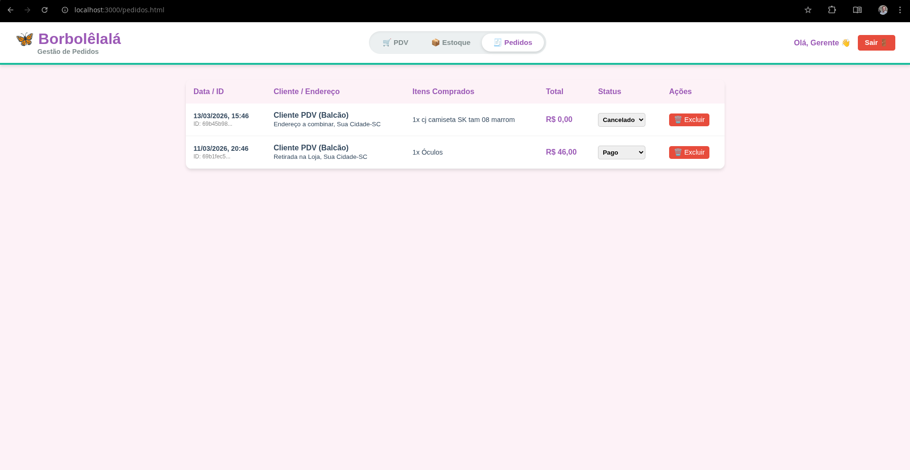

# 🦋 Borbolêlalá - Sistema de Gestão de Vendas e Estoque

> **Versão:** 3.0.0 (MVP Fullstack Seguro)  
> **Status:** Concluído / Pronto para Deploy 🚀

Bem-vindo ao repositório do **Sistema de Frente de Caixa (PDV), Backoffice e Gestão de Pedidos** da Borbolêlalá Moda Infantil. Este projeto evoluiu para uma aplicação Fullstack moderna e desacoplada, contando com um Frontend em React (Vite) e uma API RESTful no Backend (Node/Express). O sistema possui Autenticação via Tokens (JWT), controle rigoroso de rotas, reversão automática de estoque em cancelamentos, painel de relatórios dinâmico e documentação interativa com Swagger. Tudo com uma interface mobile-first, lúdica e pensada para o uso dinâmico da loja.

## Telas do Sistema
- **PDV (Frente de Caixa):** Vendas rápidas com integração de cálculo de frete.

- **Backoffice (Estoque):** CRUD de produtos protegido por autenticação.

- **Gestão de Pedidos:** Histórico de vendas, atualização de status e cancelamento com estorno inteligente de mercadorias.


## 📂 Arquitetura e Estrutura do Projeto

O projeto migrou de um monolito com Vanilla JS para uma **Arquitetura Desacoplada (Client-Server)**. O Frontend agora é uma **Single Page Application (SPA)** construída com **React**, enquanto o Backend atua puramente como uma **API RESTful** fornecendo JSON.

```plaintext
borbolelala-pdv/
│
├── frontend/
│   ├── src/
│   │   ├── components/
│   │   ├── pages/
│   │   ├── App.jsx
│   │   └── main.jsx
│   ├── index.html
│   ├── vite.config.js    
│   ├── .env
│   └── package.json
│
├── backend/
│   ├── controllers/
│   ├── middlewares/
│   ├── models/
│   ├── routes/
│   ├── services/         
│   ├── server.js         
│   ├── .env              
│   └── package.json  

```
## 🚀 Como Rodar o Projeto (Ambiente de Desenvolvimento)
Como a aplicação agora possui um Backend em Node.js e um Banco de Dados, ela deve ser executada localmente através de um servidor.

### Passo a passo:

**1. Clone este repositório:**

```
git clone https://github.com/chrissperb/3P-1-frontend.git
```

**2. Navegue até a pasta do frontend do projeto e instale as dependências:**

```
cd frontend
npm install
```
**3. Crie um arquivo chamado `.env` na raiz do projeto e configure suas credenciais:**
```
PORT=3000
MONGODB_URI=sua_string_de_conexao_do_mongodb_aqui
SUPER_FRETE_TOKEN=seu_token_oficial_da_super_frete_aqui
JWT_SECRET=sua_chave_secreta_super_segura_aquis
```
**4. Inicie o servidor:**
```
npm run dev
# ou
node server.js
```
**5. Acesse no seu navegador: http://localhost:3000**

*⚠️ Nota sobre Deploy: Como o projeto agora é Fullstack, o GitHub Pages não suporta o backend. O deploy da versão final deverá ser feito em plataformas voltadas para Node.js, como Render, Railway ou Heroku.*

## ✨ Funcionalidades Implementadas
**1. Gerenciamento de Estoque (Backoffice)**

- CRUD Completo: Criação, leitura, atualização e exclusão de produtos no MongoDB.

- Tabela Dinâmica: Visualização em tempo real da quantidade de peças disponíveis e preços.

**2. Catálogo de Produtos e PDV**

- Exibição de produtos consumidos diretamente da API do banco de dados.

- Filtros Dinâmicos: Os botões de categoria (ex: Cueca, Vestido, Acessórios) são gerados automaticamente com base nas categorias cadastradas no estoque.

**3. Carrinho Inteligente e Checkout Real**

- Agrupamento de itens repetidos no carrinho.

- Baixa Automática: Ao finalizar a venda, o sistema subtrai a quantidade exata do banco de dados automaticamente.

- Histórico de pedidos salvo com segurança na coleção pedidos (com status, dados do cliente e total).

**4. Integração Logística Avançada (Super Frete)**

- Cálculo de frete (PAC, Sedex, Mini Envios) baseado nas dimensões e peso reais da encomenda.

- Servidor atuando como Proxy (Ponte) para contornar bloqueios de CORS e proteger o Token da API.

**5. UI/UX (Interface)**

- Navegação fluida entre PDV e Estoque utilizando um Toggle Switch moderno.

- Interface Responsiva (Mobile-First) via CSS Grid e Flexbox.

**6. Segurança e Autenticação (JWT)**
- Sistema de Login com criptografia de senhas (Bcrypt).

- Proteção de rotas da API via Bearer Token.

- Controle de acesso baseado em Roles (Apenas o `admin` pode deletar produtos ou cancelar pedidos).

- Logout instantâneo no Frontend (Stateless).

**7. Gestão de Pedidos Inteligente**

- Atualização de status do pedido em tempo real (Pago, Enviado, Entregue).

- **Cancelamento Inteligente:** Ao excluir um pedido, o sistema identifica os produtos comprados e devolve as quantidades exatas para o estoque automaticamente.

**8. Documentação Interativa (Swagger)**

- API documentada utilizando o padrão OpenAPI 3.0.

- Interface gráfica interativa acessível via `/api-docs` para testes de rotas sem necessidade de softwares externos (como Postman/Thunder Client).

### 📘 Swagger UI (OpenAPI 3.0)
Toda a documentação detalhada, schemas de requisição e testes interativos podem ser acessados com o servidor rodando através da rota:
👉 **`http://localhost:3000/api-docs`**

## 📡 Documentação da API (Endpoints)

A aplicação disponibiliza uma API RESTful completa para comunicação entre o Frontend (PDV/Backoffice) e o Banco de Dados. Abaixo estão os principais endpoints disponíveis:

### 📦 Produtos (Estoque)

| Método | Rota | Descrição |
| :--- | :--- | :--- |
| `GET` | `/api/produtos` | Retorna a lista completa de produtos cadastrados. |
| `GET` | `/api/produtos/:id` | Retorna os detalhes de um produto específico pelo ID numérico. |
| `POST` | `/api/produtos` | Cadastra um novo produto no estoque. |
| `PUT` | `/api/produtos/:id` | Atualiza os dados de um produto existente. |
| `DELETE` | `/api/produtos/:id` | Remove um produto do banco de dados. |

**Exemplo de Requisição (POST `/api/produtos`):**
```json
{
  "id": 101,
  "nome": "Vestido Floral Borboleta",
  "categoria": "vestido",
  "tamanhos": ["P", "M", "G"],
  "preco": 35.00,
  "precoVenda": 65.90,
  "quantidade": 10
}
```

### 🛒 Pedidos (Checkout / Vendas)

| Método | Rota | Descrição |
| :--- | :--- | :--- |
| `GET` | `/api/pedidos` | Retorna o histórico de todas as vendas finalizadas.|
| `POST` | `/api/pedidos` | Finaliza uma venda, salva o histórico e desconta automaticamente a quantidade do estoque. |

**Exemplo de Requisição (POST `/api/pedidos`):**
```json
{
  "cliente": "Cliente PDV (Balcão)",
  "endereco": {
    "cep": "88495000",
    "logradouro": "Retirada na Loja",
    "bairro": "-",
    "cidade": "Sua Cidade",
    "estado": "SC"
  },
  "itens": [
    {
      "produtoId": 101,
      "quantidade": 2
    }
  ]
}
```

### 🚚 Logística (Super Frete)

| Método | Rota | Descrição |
| :--- | :--- | :--- |
| `POST` | `/api/frete` | Atua como um Proxy para calcular fretes reais nos Correios, repassando credenciais de forma segura. |

**Exemplo de Requisição (POST `/api/frete`):**
```json
{
  "from": { "postal_code": "88495000" },
  "to": { "postal_code": "01153000" },
  "services": "1,2,17",
  "options": {
    "own_hand": false,
    "receipt": false,
    "insurance_value": 0,
    "use_insurance_value": false
  },
  "package": {
    "weight": 0.3,
    "height": 4,
    "width": 11,
    "length": 16
  }
}
```

**Exemplo de Resposta:**
```json
[
  {
    "name": "PAC",
    "price": "22.50",
    "delivery_time": 6
  },
  {
    "name": "Sedex",
    "price": "45.90",
    "delivery_time": 2
  }
]
```

### 🔐 Autenticação (Usuários)
| Método | Rota | Descrição |
| :--- | :--- | :--- |
| `POST` | `/api/login` | Autentica o usuário e retorna o Token JWT. |
| `POST` | `/api/usuarios` | Registra um novo usuário com senha criptografada. |

### 🛒 Pedidos (Checkout / Vendas)
| Método | Rota | Descrição | Segurança |
| :--- | :--- | :--- | :--- |
| `GET` | `/api/pedidos` | Retorna o histórico de todas as vendas. | Bearer Token |
| `POST` | `/api/pedidos` | Finaliza uma venda e baixa o estoque. | Bearer Token |
| `PUT` | `/api/pedidos/:id/status` | Atualiza o status do pedido (Ex: Enviado). | Apenas Admin |
| `DELETE`| `/api/pedidos/:id` | Cancela o pedido e **estorna os itens para o estoque**. | Apenas Admin |

## 🛠️ Tecnologias Utilizadas
### Backend:

- **Node.js & Express:** Criação do servidor HTTP e roteamento dinâmico.

- **MongoDB & Mongoose:** Banco de dados NoSQL e mapeamento de objetos (ODM).

- **Axios:** Cliente HTTP para integrações externas.

- **Dotenv:** Segurança de credenciais.

- **JSON Web Tokens (JWT):** Emissão de credenciais e tokens de acesso sem estado (Stateless).

- **Bcrypt:** Algoritmo de hash para criptografia irreversível de senhas.

- **Swagger UI & OpenAPI 3.0:** Documentação interativa de endpoints exposta em rota nativa.

- **Jest:** Framework principal para execução de testes unitários rápidos.

### Frontend:

- **React (Vite):** Framework modular para construção de interfaces reativas ultravelozes.

- **React Testing Library (RTL):** Biblioteca focada em validar o comportamento e a acessibilidade da tela sob a ótica do usuário final.

- **Vitest:** Motor de execução de testes de frontend nativo e integrado ao ciclo de vida do Vite.

- **jsdom:** Ambiente de simulação de navegador web baseado em memória, rodando diretamente via terminal.

## 🧪 Engenharia de Testes e Cobertura de Código
Para atender aos rígidos critérios de homologação (mínimo de 80% de cobertura de código), o sistema foi submetido a estratégias avançadas de testes em ambas as vertentes da aplicação.

### ⚙️ Testes de Backend (Jest)
Os testes cobrem caminhos felizes e tratamentos de exceção complexos sem poluir a base de dados real, utilizando Mocks estritos das camadas adjacentes:
- **Services:** Testes focados na lógica matemática do checkout, baixas automáticas de mercadorias e estorno automático de itens de estoque no cancelamento de pedidos.

- **Middlewares:** Validação das travas de token Bearer (válidos, expirados, ausentes) e testes de granularidade no barramento de erros com o `errorHandler`.

- **Controllers:** Testes simulados isolando as respostas HTTP apropriadas (200, 201, 400, 404, 500) com base em injeções de respostas controladas dos Mocks.

### 🎨 Testes de Frontend (React Testing Library + Vitest)
Os testes de interface simulam interações reais do usuário, validando regras de experiência de usuário (UX) e acessibilidade (A11y):

- **PDV:** Inserção assíncrona de itens no carrinho, atualização instantânea de subtotais e validação de travas de segurança contra compras que excedem o estoque disponível.

- **Estoque:** Testes de filtros dinâmicos em tempo real, tratamento elegante de falhas de rede (exibição de banners de Erro 500) e validação do fluxo do interruptor do navegador (`window.confirm`) no cancelamento de exclusões.

- **Login:** Preenchimento de inputs vinculados via rótulos acessíveis (`htmlFor`) e teste do armazenamento seguro do token no `localStorage`.

- **Relatórios:** Validações de reduções estatísticas (`reduce`) para faturamento líquido e patrimônio de estoque.

## 🤖 Integração Contínua (CI/CD via GitHub Actions)
O projeto conta com uma esteira de automação de qualidade implementada por meio de workflows do GitHub Actions (`.github/workflows/ci.yml`).

A pipeline executa de forma paralela em ambientes virtuais isolados (`ubuntu-latest`) sempre que um evento de `push` ou `pull_request` é disparado nas branch principal (main).

```plaintext
                    ┌───────────────┐
                    │  Git Push /   │
                    │ Pull Request  │
                    └───────┬───────┘
                            │
            ┌───────────────┴───────────────┐
            ▼                               ▼
    ┌───────────────┐               ┌───────────────┐
    │ Job 1: Backend│               │Job 2: Frontend│
    ├───────────────┤               ├───────────────┤
    │ Node.js v20   │               │ Node.js v20   │
    │ npm install   │               │ npm install   │
    │ Jest Tests    │               │ Vitest Tests  │
    │ Cobertura >80%│               │ Cobertura >80%│
    └───────┬───────┘               └───────┬───────┘
            │                               │
            └───────────────┬───────────────┘
                            ▼
                ┌───────────────────────┐
                │ Homologado para Deploy│
                │     (Sinal Verde)     │
                └───────────────────────┘
```
Se qualquer teste falhar ou se a cobertura de código cair abaixo dos limites estabelecidos, a esteira bloqueia a alteração imediatamente, blindando o ambiente produtivo contra quebras lógicas.

### Integrações:

- API Super Frete (Cálculo logístico avançado)

## 🔮 Status do Roadmap
- [x] Criar Backend em Node.js/Express.
- [x] Implementar Banco de Dados MongoDB para persistência.
- [x] Criar CRUD de produtos e controle de estoque real.
- [x] Integrar API de fretes com cálculo de dimensões.
- [x] Criar sistema de Login (Autenticação JWT) com Bcrypt.
- [x] Implementar gestão de pedidos (Update Status / Delete).
- [x] Documentar a API utilizando Swagger / OpenAPI 3.0.
- [x] Desenvolver Dashboard de Relatórios (Vendas do mês, produtos mais vendidos).
- [x] Deploy do Monolito em nuvem (Ex: Render ou Railway).
- [x] [Novo] Criação de suítes de testes unitários no Backend (Services, Controllers e Middlewares via Jest).
- [x] [Novo] Criação de testes de UX, comportamento e acessibilidade no Frontend (Vitest e RTL).
- [x] [Novo] Configuração de pipeline paralela automatizada no GitHub Actions para validação contínua de builds.

---
Desenvolvido com 💜 pela equipe de TI da Borbolêlalá.