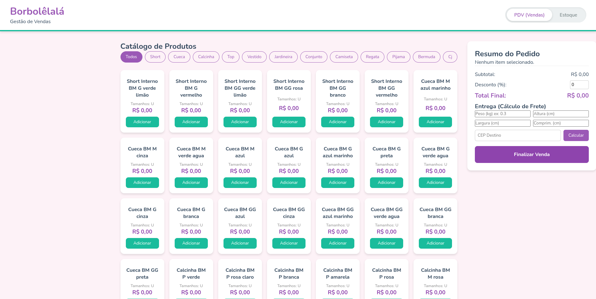
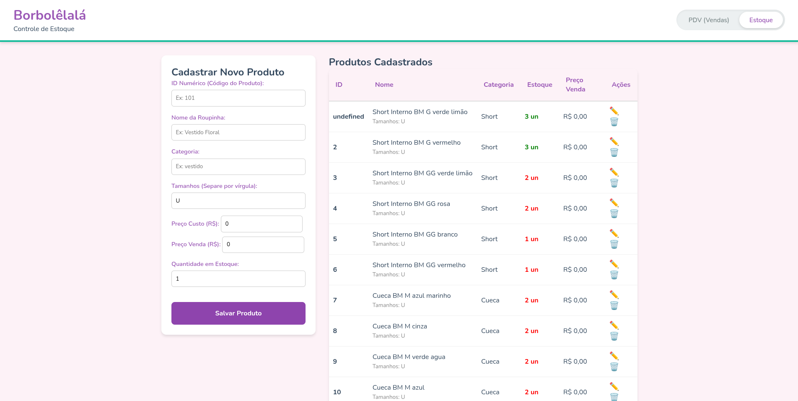

# 🦋 Borbolêlalá - Sistema de Gestão de Vendas e Estoque

> **Versão:** 2.0.0 (MVP Fullstack)  
> **Status:** Em Desenvolvimento 🚧

Bem-vindo ao repositório do **Sistema de Frente de Caixa (PDV) e Backoffice** da Borbolêlalá Moda Infantil. Este projeto evoluiu para uma aplicação Fullstack completa, permitindo o lançamento rápido de pedidos, cálculo de frete real, e gerenciamento de estoque integrado ao banco de dados, tudo com uma interface mobile-first pensada para o uso dinâmico da loja.

## Ponto de Vendas (PDV)

## Gerenciamento de Estoque


## 📂 Arquitetura e Estrutura do Projeto

O projeto migrou de uma SPA estática para um **Monolito Modular** utilizando o padrão **MVC (Model-View-Controller)** no Backend (Node.js) e Vanilla JS no Frontend.

```plaintext
borbolelala-pdv/
│
├── controllers/          
│   ├── FreteController.js
│   ├── PedidoController.js
│   └── ProdutoController.js
│
├── models/               
│   ├── pedido/Pedido.js
│   └── produto/Produto.js
│
├── routes/               
│   ├── freteRoutes.js
│   ├── pedidoRoutes.js
│   └── produtoRoutes.js
│
├── client/               
│   ├── index.html        
│   ├── estoque.html      
│   ├── app.js            
│   ├── estoque.js        
│   └── styles/
│       └──style.css  
│
├── server.js             
└── package.json          
```
## 🚀 Como Rodar o Projeto (Ambiente de Desenvolvimento)
Como a aplicação agora possui um Backend em Node.js e um Banco de Dados, ela deve ser executada localmente através de um servidor.

### Passo a passo:

**1. Clone este repositório:**

```
git clone https://github.com/chrissperb/borbolelala-pdv.git
```

**2. Navegue até a pasta do projeto e instale as dependências:**

```
cd borbolelala-pdv
npm install
```
**3. Crie um arquivo chamado `.env` na raiz do projeto e configure suas credenciais:**
```
PORT=3000
MONGODB_URI=sua_string_de_conexao_do_mongodb_aqui
SUPER_FRETE_TOKEN=seu_token_oficial_da_super_frete_aqui
```
**4. Inicie o servidor:**
```
npm run dev
# ou
node server.js
```
**5. Acesse no seu navegador: http://localhost:3000**

*⚠️ Nota sobre Deploy: Como o projeto agora é Fullstack, o GitHub Pages não suporta o backend. O deploy da versão final deverá ser feito em plataformas voltadas para Node.js, como Render, Railway ou Heroku.*

## ✨ Funcionalidades Implementadas
**1. Gerenciamento de Estoque (Backoffice)**

**- CRUD Completo:** Criação, leitura, atualização e exclusão de produtos no MongoDB.

**- Tabela Dinâmica:** Visualização em tempo real da quantidade de peças disponíveis e preços.

**2. Catálogo de Produtos e PDV**

- Exibição de produtos consumidos diretamente da API do banco de dados.

- Filtros Dinâmicos: Os botões de categoria (ex: Cueca, Vestido, Acessórios) são gerados automaticamente com base nas categorias cadastradas no estoque.

**3. Carrinho Inteligente e Checkout Real**

- Agrupamento de itens repetidos no carrinho.

- Baixa Automática: Ao finalizar a venda, o sistema subtrai a quantidade exata do banco de dados automaticamente.

- Histórico de pedidos salvo com segurança na coleção pedidos (com status, dados do cliente e total).

**4. Integração Logística Avançada (Super Frete)**

- Cálculo de frete (PAC, Sedex, Mini Envios) baseado nas dimensões e peso reais da encomenda.

- Servidor atuando como Proxy (Ponte) para contornar bloqueios de CORS e proteger o Token da API.

**5. UI/UX (Interface)**

- Navegação fluida entre PDV e Estoque utilizando um Toggle Switch moderno.

- Interface Responsiva (Mobile-First) via CSS Grid e Flexbox.

## 🛠️ Tecnologias Utilizadas
### Backend:

- Node.js & Express (Criação do Servidor e API REST)

- MongoDB & Mongoose (Banco de Dados NoSQL e Modelagem)

- Axios (Cliente HTTP para integrações externas)

- Dotenv (Segurança de credenciais)

### Frontend:

- HTML5 & CSS3 (Semântica, Flexbox, Grid)

- Vanilla JavaScript (ES6+, DOM Manipulation, Fetch API)

### Integrações:

- API Super Frete (Cálculo logístico avançado)

## 🔮 Próximos Passos (Roadmap)
[x] Criar Backend em Node.js/Express.

[x] Implementar Banco de Dados MongoDB para persistência do catálogo.

[x] Criar CRUD de produtos e controle de estoque real.

[x] Integrar API de fretes com cálculo de dimensões.

[ ] Criar sistema de Login (Autenticação JWT) para controle de acesso de vendedores.

[ ] Desenvolver Dashboard de Relatórios (Vendas do mês, produtos mais vendidos).

[ ] Deploy do Monolito em nuvem (Ex: Render).

---
Desenvolvido com 💜 pela equipe de TI da Borbolêlalá.