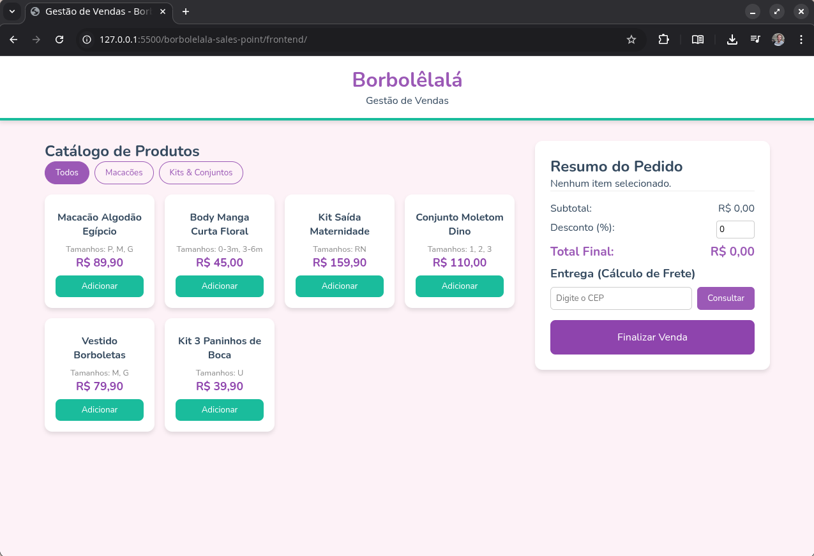

# 🦋 Borbolêlalá - Sistema de Gestão de Vendas (PDV)

> **Versão:** 1.0.0 (MVP Frontend)  
> **Status:** Em Desenvolvimento 🚧

Bem-vindo ao repositório do **Sistema de Frente de Caixa (PDV)** da Borbolêlalá Moda Infantil. Este projeto visa facilitar o dia a dia da loja, permitindo o lançamento rápido de pedidos, cálculo de descontos e consulta de frete, tudo com uma interface mobile-first pensada para o uso em balcão.



## 📂 Estrutura do Projeto

O projeto segue uma arquitetura **SPA (Single Page Application)** simples, baseada em tecnologias web padrão (Vanilla JS), sem necessidade de transpilação nesta etapa.

```plaintext
borbolelala-pdv/
│
├── index.html      # Estrutura Semântica (Catálogo e Checkout)
├── style.css       # Estilização (Identidade Visual, Grid e Flexbox)
├── app.js          # Lógica de Negócio, Mock de Dados e APIs
└── README.md       # Documentação do Projeto
```

### Detalhes dos Arquivos:
- `index.html`: Contém o esqueleto da aplicação, dividido em duas grandes áreas: Catálogo de Produtos e Painel de Vendas.

- `style.css`: Utiliza Variáveis CSS (:root) para gerenciar a paleta de cores (Lilás, Verde Água) e Grid Layout para responsividade automática.

- `app.js`: Centraliza a lógica. Atualmente opera com dados "Mockados" (simulados) para produtos, mas já possui integração real via fetch para consulta de CEP.


## 🚀 Como Rodar o Projeto
Como esta etapa é puramente Frontend Estático, você tem duas opções:

**Opção 1: Rodar Localmente**

1. Clone este repositório:

```Bash
git clone https://github.com/chrissperb/borbolelala-pdv.git
```
2. Navegue até a pasta do projeto.

3. Abra o arquivo `index.html` diretamente no seu navegador (Chrome, Firefox, Edge).

- **Dica Pro:** Se usar VS Code, instale a extensão Live Server e clique em "Go Live" para ter atualização automática.

**Opção 2: GitHub Pages (Deploy Automático)**

Este projeto está configurado para rodar via GitHub Actions/Pages.

1. Faça o push do código para a branch `main`.

2. Acesse as configurações do repositório no GitHub -> **Pages**.

3. O sistema estará disponível em: `https://chrissperb.github.io/borbolelala-pdv/`

## ✨ Funcionalidades Implementadas
**1. Catálogo de Produtos (Mock)**
- Exibição de produtos em Grid responsivo.

- Suporte a variações típicas de moda infantil (Tamanhos: RN, P, M, G, 1, 2, 3).

- **Filtros de Categoria:** Permite alternar rapidamente entre "Macacões", "Kits", etc.

**2. Carrinho e Calculadora de Vendas**
- **Adição/Remoção:** Itens são adicionados a uma lista temporária (array em memória).

- **Cálculo Automático:** O subtotal é atualizado a cada interação.

- **Descontos Dinâmicos:** Campo para inserir porcentagem de desconto (ex: 5% ou 10% à vista), recalculando o total final instantaneamente.

**3. Integração com API (CEP)**
- Consumo da API pública `ViaCEP`.

- Ao digitar o CEP, o sistema preenche automaticamente Cidade, Estado e Logradouro.

- Lógica visual de validação (exibe erro se o CEP for inválido).

**4. UI/UX (Interface)**
- **Mobile-First:** Layout otimizado para celulares (botões grandes para toque).

- **Feedback Visual:** Cores suaves e mensagens de estado (ex: carrinho vazio, carregando CEP).

## 🛠️ Tecnologias Utilizadas
- **HTML5** (Semântico)

- **CSS3** (Flexbox, Grid, CSS Variables)

- **JavaScript** (ES6+, Async/Await, DOM Manipulation)

- **Node:** Biblioteca de utilitários para o JavaScript

- **API Externa:** ViaCEP

## 🔮 Próximos Passos (Roadmap)
- [ ] Criar Backend em **Node.js/Express**.

- [X] Implementar Banco de Dados **MongoDB** para persistência do catálogo.

- [ ] Criar sistema de Login para vendedores.

---

Desenvolvido com 💜 pela equipe de TI da Borbolêlalá.